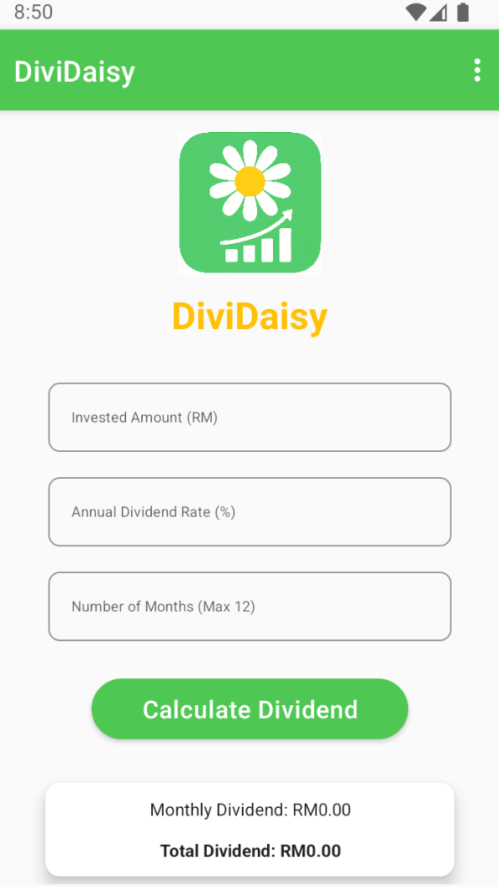
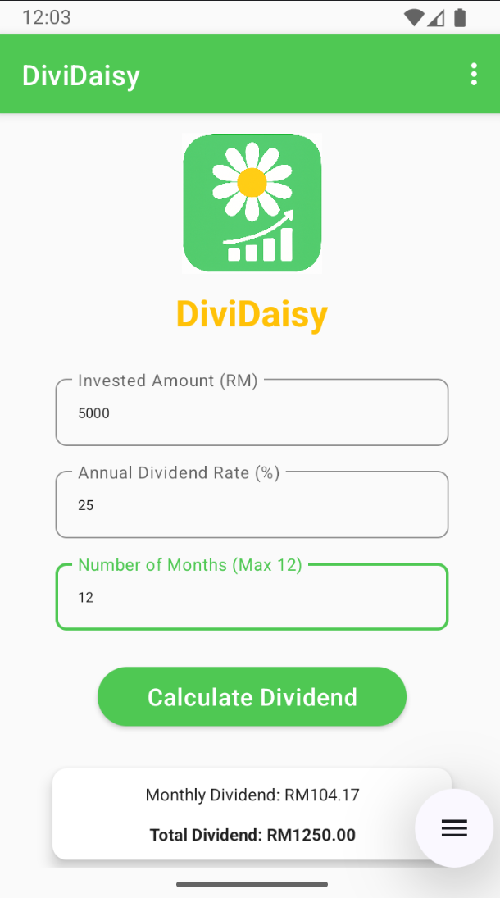
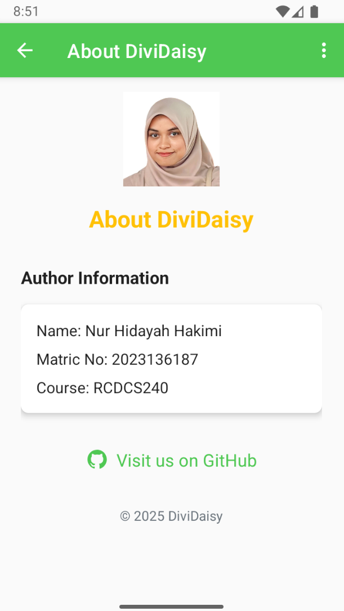

DiviDaisy - Unit Trust Dividend Calculator

📘 Project Overview
DiviDaisy is an Android application developed for ICT602 Assignment 1. The app provides a convenient way for users to calculate unit trust dividends by entering the number of units and dividend rate per unit. It is designed with a clean and responsive interface for a smooth mobile experience.

📱 Features
- Calculate unit trust dividend based on user input
- Simple and intuitive user interface
- Responsive design suitable for all screen sizes

🔧 Technologies Used
- Android Studio
- Java
- XML Layout

🚀 How to Use
1. Download the APK from the [Releases](https://github.com/hdyahhkmi/DiviDaisy/releases) section.
2. Install it on your Android device (enable "Install from Unknown Sources" if needed).
3. Open the app, enter the required details, and click "Calculate" to view the dividend result.

## 🖼️ Screenshots
Add screenshots here using:
```markdown



